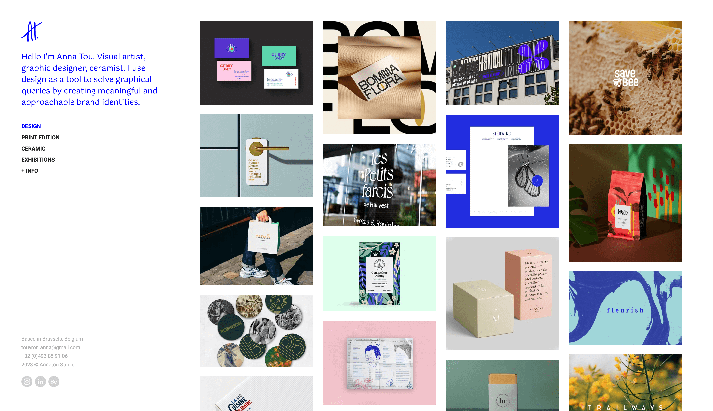

# Annatou Studio's Portfolio Website

This repo contains a static website written with [GatsbyJS](https://www.gatsbyjs.org/), integrated with content coming from [DatoCMS](https://www.datocms.com) and show the works of Annatou Studio.



[See it live](https://anna-touvron.com/)

## About

This websites uses:

- [Yarn](https://yarnpkg.com/) as package manager;
- [GatsbyJS](https://github.com/gatsbyjs/gatsby) as website generator;
- [gatsby-source-datocms](https://github.com/datocms/gatsby-source-datocms) to integrate the website with DatoCMS.

## Prerequisites

- macOS (Apple Silicon supported – see Rosetta notes below)
- Node 14.x (exact major required by the legacy Gatsby v2 stack)
- Yarn 1.x (Classic)
- A DatoCMS API token with read access to the project content

## Environment Variables

Create a `.env` file at the project root:

```
DATO_API_TOKEN=your_readonly_token_here
```

Never commit real tokens. Rotate any token that has been exposed publicly.

## Apple Silicon (M1/M2/M3) Setup

This project depends on packages that expect an x64 (Intel) Node 14 build. Native ARM builds of Node 14 can fail to compile on recent macOS SDKs. Use Rosetta:

```bash
# One‑time (if not already installed)
softwareupdate --install-rosetta --agree-to-license

# Start an x64 shell and install/use Node 14 via nvm
arch -x86_64 zsh -c 'export NVM_DIR="$HOME/.nvm"; . "$NVM_DIR/nvm.sh"; nvm install 14; nvm use 14; node -v'
```

You can create a helper script (`scripts/x64.sh` for example):

```bash
#!/usr/bin/env bash
arch -x86_64 zsh -c 'export NVM_DIR="$HOME/.nvm"; . "$NVM_DIR/nvm.sh"; nvm use 14 >/dev/null; exec "$@"'
```

Then run commands as: `scripts/x64.sh yarn build`.

## Install Dependencies

Use Yarn (preferred because `yarn.lock` reflects the working dependency tree):

```bash
arch -x86_64 zsh -c 'export NVM_DIR="$HOME/.nvm"; . "$NVM_DIR/nvm.sh"; nvm use 14 >/dev/null; yarn install'
```

If a `package-lock.json` was generated inadvertently (by running `npm install`), delete it to avoid divergence with `yarn.lock`.

## Development

```bash
arch -x86_64 zsh -c 'export NVM_DIR="$HOME/.nvm"; . "$NVM_DIR/nvm.sh"; nvm use 14 >/dev/null; yarn develop'
```

The site will be served at `http://localhost:8000` with GraphiQL at `http://localhost:8000/___graphql`.

## Production Build

```bash
arch -x86_64 zsh -c 'export NVM_DIR="$HOME/.nvm"; . "$NVM_DIR/nvm.sh"; nvm use 14 >/dev/null; yarn build'
```

Output is written to `public/`.

To speed up local build while debugging you can skip JS minification:

```bash
arch -x86_64 zsh -c 'export NVM_DIR="$HOME/.nvm"; . "$NVM_DIR/nvm.sh"; nvm use 14 >/dev/null; yarn build --no-uglify'
```

## Troubleshooting

| Issue                                                                     | Fix                                                                                              |
| ------------------------------------------------------------------------- | ------------------------------------------------------------------------------------------------ |
| Node 14 compile fails on Apple Silicon                                    | Use Rosetta x64 shell (`arch -x86_64 ...`) and install Node 14 there.                            |
| `node-sass` build errors / needs Python 2                                 | Ensure you are on Node 14 x64; avoid Node 16+.                                                   |
| Build appears “stuck” at “Building production JavaScript and CSS bundles” | It’s bundling & compiling Sass. Let it finish; use `--no-uglify` to speed up.                    |
| Redux minified error during build                                         | Reinstall dependencies with Yarn (`rm -rf node_modules && yarn install`).                        |
| `caniuse-lite is outdated` warning                                        | Optional: `npx browserslist@latest --update-db` (don’t commit if you want deterministic builds). |

## Security

Rotate DatoCMS tokens if they are ever printed or shared. Prefer read‑only tokens for local dev.

## Modernization Path (Future Work)

To upgrade: migrate to Gatsby v5/6+, replace `gatsby-plugin-sass` v2 + `node-sass` with modern `sass` (dart-sass) only, update React to 18+, then relax the Node engine to an LTS (18/20/22). This removes Rosetta/Node14 constraints.

## License

MIT
